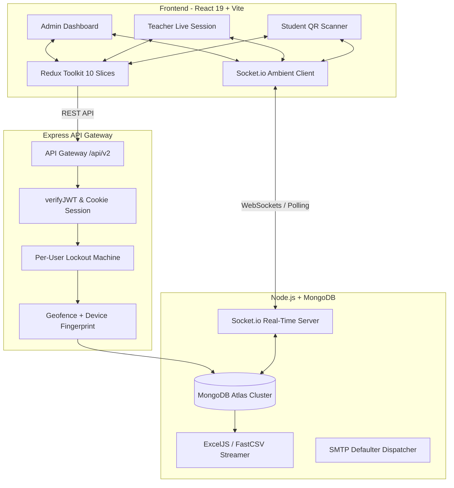

# AttendX — CSIT Attendance Management System (CSIT_AMS)

<p align="center">
  
  
  
  
  
  
  
  
  
</p>

AttendX (CSIT AMS) is an enterprise-grade university attendance management system designed for Academic Institutes and Computer Science Departments. It combines dynamic rotating QR-code scanning with multi-layered anti-fraud defense (geolocation geofencing, IP matching, and physical device fingerprinting) to completely eliminate proxy attendance and buddy punching.

---

## Key Highlights & Features

### 🛡️ Multi-Layer Anti-Fraud Attendance
- **Rotating Cryptographic QR**: Dynamic JWT payload salted and regenerated every 20 seconds, preventing photo sharing and proxy scans.
- **Hardware Device Lock**: Binds each student account to a single physical smartphone fingerprint to block buddy punching.
- **Haversine Geofencing**: Computes real-time distance between teacher and student coordinates (default 50m radius).
- **Campus Subnet Matching**: Verifies student and instructor share the same campus Wi-Fi network subnet.

### 👥 Role-Based Portals & Dashboards
- **Administrator**: Comprehensive oversight of batches, departments, disciplines, syllabi, user directories, hardware device reset approvals, and promotion cycles.
- **Teacher/Faculty**: One-click live session launch, live real-time attendance tallying via WebSockets, manual exception overrides, roster inspection, and session histories.
- **Student**: Mobile-first camera scanner, personal course summaries, semester-wise attendance logs, and instant defaulter status notifications.

### 🎓 Academic Flexibility
- **Manual Section Management**: Add sections mid-batch (e.g. for transfers/migrants) and upload Excel rosters per-section.
- **Per-Batch Curriculum Overrides**: Customize subject offerings for specific cohorts without modifying the master institutional syllabus.
- **Batch Promotion & Graduation**: Seamless semester advancement with automatic curriculum transitions and safe rollback capabilities.

### 📊 Universal Reporting & Analytics Engine
- 12+ multi-dimensional report views (Subject-wise, Defaulters <75%, Student Transcripts, Teacher Utilization).
- Direct binary file streaming of styled Microsoft Excel (`.xlsx`) workbooks and raw CSVs.
- Automatic weekly email alerts dispatched to student defaulters.

### 📱 300px Universal Mobile Responsiveness
- Engineered from the ground up for ultra-compact devices down to **300px viewport width**.
- Isolated horizontal table scrollers, dynamic camera viewfinders, and touch-first action buttons (no hover requirements).

---

## System Architecture



---

## Monorepo Directory Structure

```
CSIT_AMS/
├── backend/                       # Express 4 + MongoDB Node.js Backend
│   ├── config/                    # MongoDB Atlas connection
│   ├── src/
│   │   ├── controllers/           # REST API Route Controllers
│   │   ├── middlewares/           # JWT, Role Guard, Anti-Fraud & Traffic Loggers
│   │   ├── models/                # 13 Mongoose Schemas & Pre-Save Hooks
│   │   ├── routes/                # Express Route Declarations
│   │   ├── services/              # Socket.io, Cron & Analytics Services
│   │   ├── tests/                 # Jest Automated Unit & Integration Suites
│   │   └── utils/                 # Seeders, Async Handlers & Token Signers
│   ├── app.js                     # cPanel Phusion Passenger Entrypoint
│   └── server.js                  # Standalone Express Server Entrypoint
│
├── frontend/                      # React 19 + Tailwind CSS Frontend
│   ├── src/
│   │   ├── components/            # Reusable UI Components & Modals
│   │   ├── pages/                 # Admin, Teacher, Student & Auth Views
│   │   ├── store/                 # Redux Toolkit Store & 10 Domain Slices
│   │   └── services/              # Axios Client & Socket Provider
│   └── vite.config.js             # Vite Build & Production Bundler
│
├── docs/                          # Comprehensive Technical Documentation
│   ├── README.md                  # Documentation Hub & Sitemap
│   ├── api/                       # Endpoint Contracts & Request/Response Payloads
│   ├── schema/                    # Database Model Specs & Pre-Save Logic
│   ├── data-flow/                 # Sequence Diagrams & State Machines
│   ├── frontend/                  # Responsive Design & State Tree Guidelines
│   └── deployment/                # cPanel & GitHub Actions Auto-Deploy Guides
│
└── .github/workflows/deploy.yml   # Push-to-Deploy CI/CD for cPanel Production
```

---

## Local Development Quickstart

### Prerequisites
- Node.js 18.x or 20.x installed
- Git installed
- MongoDB database (local or free MongoDB Atlas cluster)

### 1. Clone the Repository
```bash
git clone https://github.com/your-username/CSIT_AMS.git
cd CSIT_AMS
```

### 2. Backend Setup
```bash
cd backend
npm install
```
Create `.env` in `backend/` (or copy from `.env.production.example`):
```ini
PORT=5001
NODE_ENV=development
MONGODB_URI=your_mongodb_connection_string
JWT_ACCESS_SECRET=your_jwt_access_secret_key
JWT_REFRESH_SECRET=your_jwt_refresh_secret_key
QR_SECRET=your_qr_secret_key
ADMIN_SECRET=jam-2025
CLIENT_URL=http://localhost:5173
```

Seed initial database with complete test academic structures, faculty, and batches:
```bash
node seedData.js
```

Start the backend dev server:
```bash
npm run dev
```

### 3. Frontend Setup
In a separate terminal window:
```bash
cd frontend
npm install
```
Start the frontend dev server:
```bash
npm run dev
```
Open your browser at `http://localhost:5173`.

---

## Automated Test Verification

AttendX includes a comprehensive Jest test suite covering authentication, academic allocations, live sessions, security lockouts, and attendance marking:

```bash
cd backend
npm test
```
**Test Results:**
```
PASS src/tests/controllers/academic.test.js
PASS src/tests/controllers/attendance.test.js
PASS src/tests/controllers/admin.test.js
PASS src/tests/controllers/auth.test.js
PASS src/tests/controllers/session.test.js
PASS src/tests/controllers/system.test.js

Test Suites: 6 passed, 6 total
Tests:       51 passed, 51 total
```

---

## Production Deployment & CI/CD

AttendX is fully prepared for zero-downtime deployment to cPanel using **Phusion Passenger** and **GitHub Actions**:

- **Production Subdomains**:
  - Frontend: `https://csitattendance.csitfmcs.com.pk`
  - Backend API: `https://csitattendanceapi.csitfmcs.com.pk`
- **Continuous Deployment (CI/CD)**:
  Every push to the `main` branch automatically triggers [`.github/workflows/deploy.yml`](.github/workflows/deploy.yml) to compile the React production bundle, sync files over secure FTP, and hot-reload Phusion Passenger. Pushes to `dev` or feature branches do not trigger production deployments.

For detailed setup instructions, refer to:
- 📖 [cPanel Deployment Guide](docs/deployment/cpanel.md)
- 🚀 [Automated GitHub Push-to-Deploy Guide](docs/deployment/auto-deploy-github.md)

---

## Documentation Suite

The complete documentation suite is organized in `docs/`:
- [Master Documentation Hub](docs/README.md)
- [REST API Specifications](docs/api/)
- [Database Schemas](docs/schema/)
- [Data Flow & Sequence Diagrams](docs/data-flow/)
- [300px Responsive System Guide](docs/frontend/responsive-system.md)
- [Frontend Architecture](docs/frontend/architecture.md)

---

## License

This project is licensed under the MIT License — see the LICENSE file for details.
