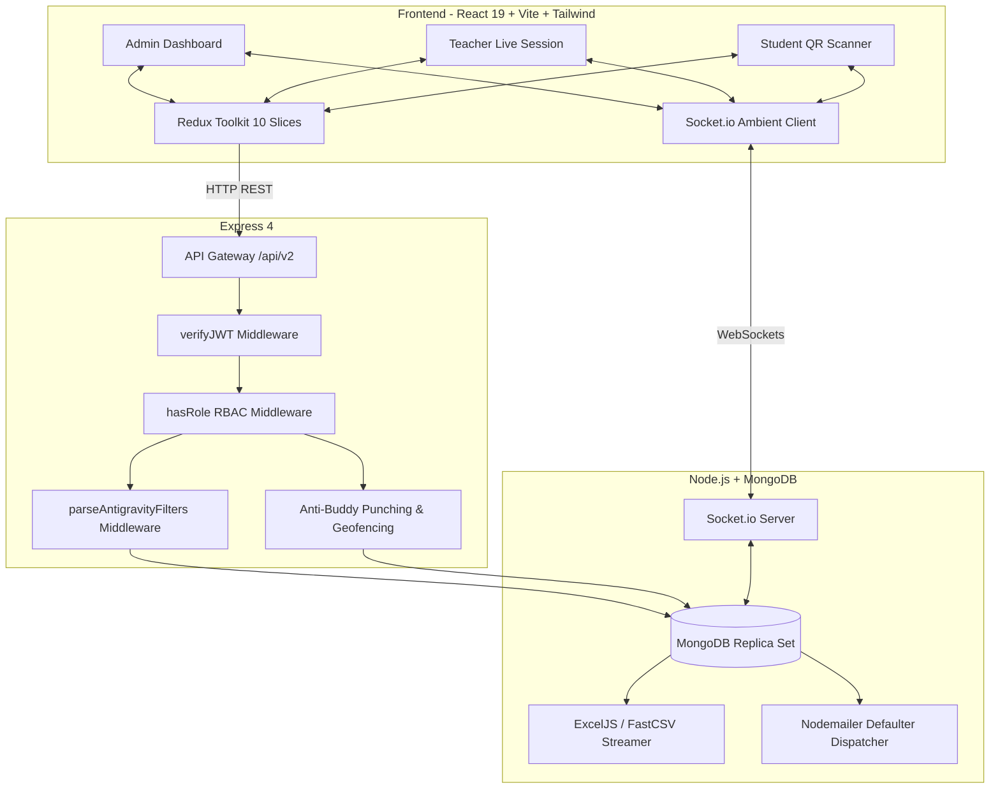

# AttendX (CSIT AMS) Master Documentation Hub

Welcome to the comprehensive technical documentation for the **CSIT Attendance Management System (AttendX)**. This repository houses the complete architecture, API contracts, database schemas, frontend design systems, and data flow specifications.

---

## Documentation Sitemap

```
docs/
├── README.md                      # Master Documentation Hub (You are here)
│
├── api/                           # Backend REST API Specifications
│   ├── academic.md                # Batches, Sections, Per-Batch Subjects, Allocations & Rosters
│   ├── admin.md                   # User Management, Device Reset, Unlocks & Offboarding
│   ├── analytics.md               # Universal Reporting Pipeline & Excel/CSV Export
│   ├── attendance.md              # QR Verification, Multi-Layer Security & Manual Overrides
│   ├── auth.md                    # Authentication, 2FA, Lockout & Profile Setup
│   ├── notification.md            # In-App Notifications, Read Receipts & Auto-Purging
│   ├── session.md                 # Live Sessions, Rotating QR Generation & Lifecycle
│   ├── system.md                  # Departments, Disciplines, Subjects & Syllabi
│   └── systemSettings.md          # University-Wide Configuration & Geofencing Bounds
│
├── schema/                        # MongoDB Database Schemas (Mongoose)
│   ├── academic-foundation.md     # Department, Discipline & Subject Schemas
│   ├── attendance.md              # Attendance Schema, Status Enums & Auto-Deriving Pre-Hooks
│   ├── auditLogs.md               # DeviceResetLog, SystemTrafficLog, SystemSettings & OTP
│   ├── batch.md                   # Batch Schema, Sections Array & Subject Overrides
│   ├── courseAllocation.md        # Course Allocation & Section Assignment Schema
│   ├── notification.md            # Notification Schema & 30-Day TTL Index
│   ├── session.md                 # Live Session Schema & Security Configuration
│   └── user.md                    # User Schema, Role Attributes & Lockout State
│
├── data-flow/                     # System Architecture & State Machine Diagrams
│   ├── batch-creation.md          # 5-Step Wizard for Manual Batch & Section Uploads
│   ├── batch-promotion.md         # Semester Promotion, Curriculum Transition & Rollback
│   ├── login-lockout.md           # Per-User Failed Attempt Counter & Lockout Machine
│   ├── qr-attendance-flow.md      # Live Rotating QR Code, Fraud Checks & Socket Tally
│   ├── reports-pipeline.md        # Universal Query Filtering & Aggregation Flow
│   └── session-lifecycle.md       # Session State Progression (Start → Scan → End)
│
└── frontend/                      # Client-Side Architecture & UI Systems
    ├── architecture.md            # Redux Toolkit Slices, Route Guards & Socket Provider
    ├── integration.md             # Thunk Action Mappings & Modal Integration Patterns
    └── responsive-system.md       # 300px Mobile-First Standard & Touch Accessibility

├── deployment/                    # Production Deployment Guides
│   ├── cpanel.md                  # Complete cPanel & Phusion Passenger Deployment Guide
│   └── auto-deploy-github.md      # Automated Push-to-Deploy CI/CD with GitHub Actions & Webhooks
```

---

## System Architecture Overview



---

## Quick Reference Links

- **Testing Credentials & Test Rosters**: Refer to [Walkthrough Guide](file:///C:/Users/mjstudio/.gemini/antigravity-ide/brain/94f6dbb7-e8e6-4b5d-b990-b11f4a6459ca/walkthrough.md#test-data-seeded-for-verification).
- **Responsive 300px Guidelines**: Refer to [Responsive System Guide](file:///j:/Programming/MERN%20Projects/AttendX/AttendX/CSIT_AMS/docs/frontend/responsive-system.md).
- **Security & Multi-Layer Anti-Fraud**: Refer to [QR Attendance Architecture](file:///j:/Programming/MERN%20Projects/AttendX/AttendX/CSIT_AMS/docs/data-flow/qr-attendance-flow.md).
