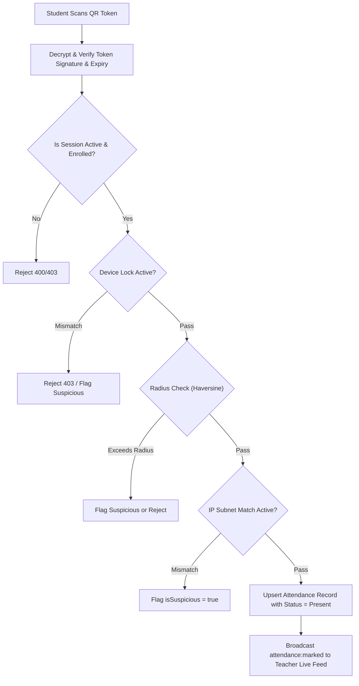

# Attendance API Documentation

Base URL: `/api/v2/attendance`

## Overview
The Attendance module processes incoming student attendance scans, enforces multi-layered fraud prevention (geolocation, IP subnets, device fingerprint locking), and provides teacher and admin override tools (individual status edits and bulk roster marking).

---

## Endpoints Summary

| Method | Endpoint | Access | Description |
|---|---|---|---|
| `POST` | `/mark` | Student | Verify credentials/context and mark student attendance via QR scan |
| `PUT` | `/:id` | Teacher, Admin | Update status of a specific attendance record (Present, Absent, Late, Leave) |
| `POST` | `/bulk` | Teacher, Admin | Insert or update bulk attendance records for a session |

---

## Anti-Fraud Verification Pipeline (`POST /mark`)

When a student scans a QR code, the request passes through the following multi-layer security pipeline:



---

## Detailed Endpoint Specifications

### 1. Mark Attendance (Student Scan)
`POST /api/v2/attendance/mark`

Mark attendance for the authenticated student using the decrypted QR token payload.

**Headers:**
```http
Authorization: Bearer <accessToken>
Content-Type: application/json
```

**Request Body:**
```json
{
  "qrToken": "eyJhbGciOiJIUzI1NiIsInR5cCI6IkpXVCJ9...",
  "latitude": 33.6845,
  "longitude": 73.0480,
  "deviceId": "a8f9c10b23d4e5f6"
}
```

**Response (`200 OK`):**
```json
{
  "statusCode": 200,
  "data": {
    "attendanceId": "65b8cb44e2f3a4b5c6d7e8fa",
    "status": "Present",
    "verificationMethod": "QR",
    "markedAt": "2026-09-16T10:05:12.000Z",
    "isSuspicious": false,
    "distance": 14.2
  },
  "message": "Attendance marked successfully"
}
```

**Error Responses:**
- `400 Bad Request`: `Session is not active` or `Invalid/expired QR code`
- `403 Forbidden`: `DEVICE_MISMATCH: Your account is bound to another device. Contact Admin to reset.`
- `403 Forbidden`: `STUDENT_NOT_ENROLLED: You are not enrolled in this section or subject.`
- `409 Conflict`: `ATTENDANCE_ALREADY_MARKED: You have already marked attendance for this session.`

---

### 2. Update Attendance Record (Teacher Override)
`PUT /api/v2/attendance/:id`

Allows a teacher or administrator to manually adjust an attendance status (e.g., changing from Absent to Present (Manual) or Leave).

**Request Body:**
```json
{
  "status": "Present (Manual)",
  "reason": "Student provided verified medical slip"
}
```

**Response (`200 OK`):**
```json
{
  "statusCode": 200,
  "data": {
    "_id": "65b8cb44e2f3a4b5c6d7e8fa",
    "status": "Present (Manual)",
    "verificationMethod": "Manual"
  },
  "message": "Attendance status updated successfully"
}
```

---

### 3. Bulk Attendance Submission
`POST /api/v2/attendance/bulk`

Used during manual or retroactive attendance entry where the teacher marks the entire section roster at once.

**Request Body:**
```json
{
  "sessionId": "65b8ca12e2f3a4b5c6d7e8f9",
  "records": [
    { "studentId": "65b8c777e2f3a4b5c6d7e8d0", "status": "Present" },
    { "studentId": "65b8c777e2f3a4b5c6d7e8d1", "status": "Absent" },
    { "studentId": "65b8c777e2f3a4b5c6d7e8d2", "status": "Late" }
  ]
}
```

**Response (`200 OK`):**
```json
{
  "statusCode": 200,
  "data": {
    "totalProcessed": 3,
    "inserted": 3,
    "updated": 0
  },
  "message": "Bulk attendance recorded successfully"
}
```
