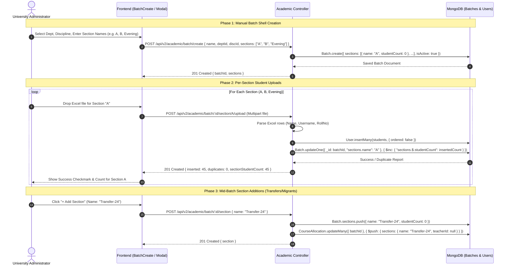

# Batch Creation & Section Uploads Data Flow

```mermaid
sequenceDiagram
    autonumber
    actor Admin as University Administrator
    participant UI as Frontend (BatchCreate / Modal)
    participant AC as Academic Controller
    participant DB as MongoDB (Batches & Users)

    Note over Admin, DB: Phase 1: Manual Batch Shell Creation
    Admin->>UI: Select Dept, Discipline, Enter Section Names (e.g. A, B, Evening)
    UI->>AC: POST /api/v2/academic/batch/create { name, deptId, discId, sections: ["A", "B", "Evening"] }
    AC->>DB: Batch.create({ sections: [{ name: "A", studentCount: 0 }, ...], isActive: true })
    DB-->>AC: Saved Batch Document
    AC-->>UI: 201 Created { batchId, sections }

    Note over Admin, DB: Phase 2: Per-Section Student Uploads
    loop For Each Section (A, B, Evening)
        Admin->>UI: Drop Excel file for Section "A"
        UI->>AC: POST /api/v2/academic/batch/:id/section/A/upload (Multipart file)
        AC->>AC: Parse Excel rows (Name, Username, RollNo)
        AC->>DB: User.insertMany(students, { ordered: false })
        AC->>DB: Batch.updateOne({ _id: batchId, "sections.name": "A" }, { $inc: { "sections.$.studentCount": insertedCount } })
        DB-->>AC: Success / Duplicate Report
        AC-->>UI: 201 Created { inserted: 45, duplicates: 0, sectionStudentCount: 45 }
        UI-->>Admin: Show Success Checkmark & Count for Section A
    end

    Note over Admin, DB: Phase 3: Mid-Batch Section Additions (Transfers/Migrants)
    Admin->>UI: Click "+ Add Section" (Name: "Transfer-24")
    UI->>AC: POST /api/v2/academic/batch/:id/section { name: "Transfer-24" }
    AC->>DB: Batch.sections.push({ name: "Transfer-24", studentCount: 0 })
    AC->>DB: CourseAllocation.updateMany({ batchId }, { $push: { sections: { name: "Transfer-24", teacherId: null } } })
    AC-->>UI: 201 Created { section }
```
