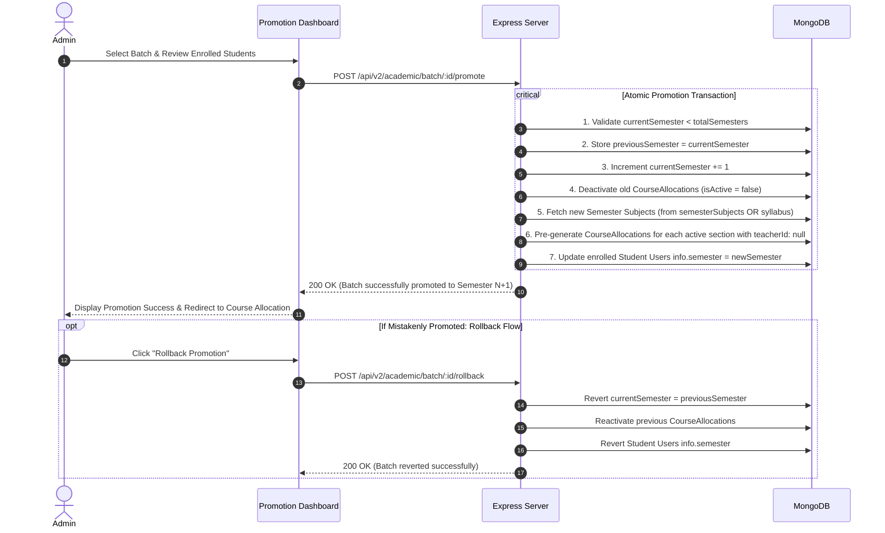

# Batch Promotion & Semester Lifecycle Data Flow

This document details the academic progression model for batches advancing through semesters (e.g. from Semester 1 to Semester 8), handling curriculum transitions, graduation completion, and rollback contingencies.

---

## Promotion Workflow Diagram

---

## Batch Graduation / Completion Flow
When a batch reaches its final semester (e.g., Semester 8):
1. Admin triggers `POST /api/v2/academic/batch/:id/complete`.
2. System sets `currentSemester = 0` and `isActive = false`.
3. All enrolled student accounts are archived (`isActive = false`).
4. Course allocations are frozen.
5. All attendance and session histories remain permanently readable for transcript generation and institutional audits.
