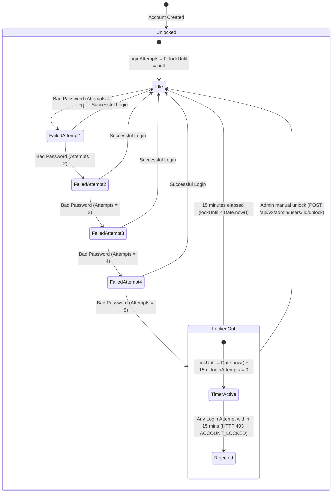

# Per-User Login Lockout State Machine

### Key Differences: Per-User vs. IP-Based Rate Limiting

| Feature | Legacy IP Rate Limiting | AttendX Per-User Lockout |
|---|---|---|
| **Scope** | Entire IP address / NAT subnet | Single `User` account only |
| **Shared Networks (Campus Labs/WiFi)** | All lab students locked if 1 fails | Only the failing student is locked |
| **Persistence** | In-memory (lost on restart) | MongoDB document (`lockUntil`, `loginAttempts`) |
| **Admin Override** | Not possible without restarting server | Admin endpoint `POST /admin/users/:id/unlock` |
| **DoS Guard** | Handled by low threshold | High outer threshold (500/15min) retains bot protection |
