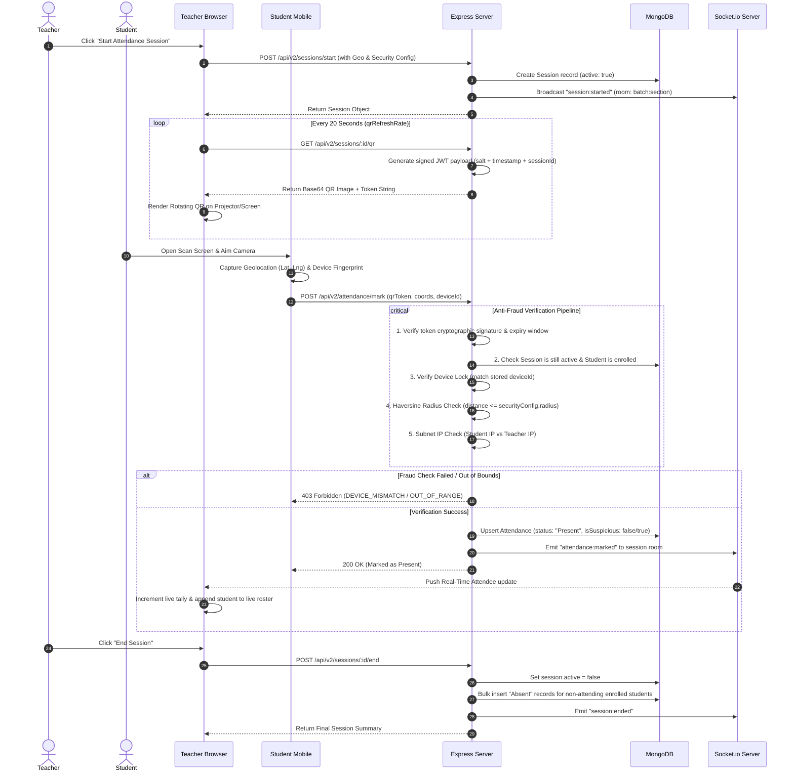

# Live QR Attendance Flow Architecture

This document details the end-to-end data flow for live attendance verification using rotating cryptographic QR codes, anti-fraud evaluation, and real-time WebSocket tallying.

---

## Sequence Diagram

---

## Anti-Fraud Security Layers

### 1. Dynamic Rotating QR (Anti-Replay / Anti-Screenshot)
- The QR code changes dynamically every 20 seconds.
- The payload is a signed JWT containing `sessionId`, `generatedAt`, and a cryptographic hash.
- Expired tokens or screenshots sent via messaging apps are automatically rejected.

### 2. Device Fingerprint Locking (Anti-Buddy Punching)
- On first scan, the student's mobile hardware fingerprint (`deviceId`) is bound to their `User` record in MongoDB.
- Subsequent scans must match this `deviceId`.
- A single physical smartphone cannot be used to log attendance for multiple student accounts.
- Hardware resets require an administrative override logged in `DeviceResetLog`.

### 3. Geofencing (Haversine Distance)
- The teacher's browser records GPS coordinates when launching the session.
- The student's device submits high-accuracy GPS coordinates during scanning.
- If distance exceeds the classroom threshold (default: 50 meters), the scan is either rejected or flagged as `isSuspicious = true`.

### 4. IP Subnet Matching
- The teacher's local network IP is captured at session launch.
- The student's client IP is inspected to verify they are connected to the same campus Wi-Fi network rather than remote cellular data.
