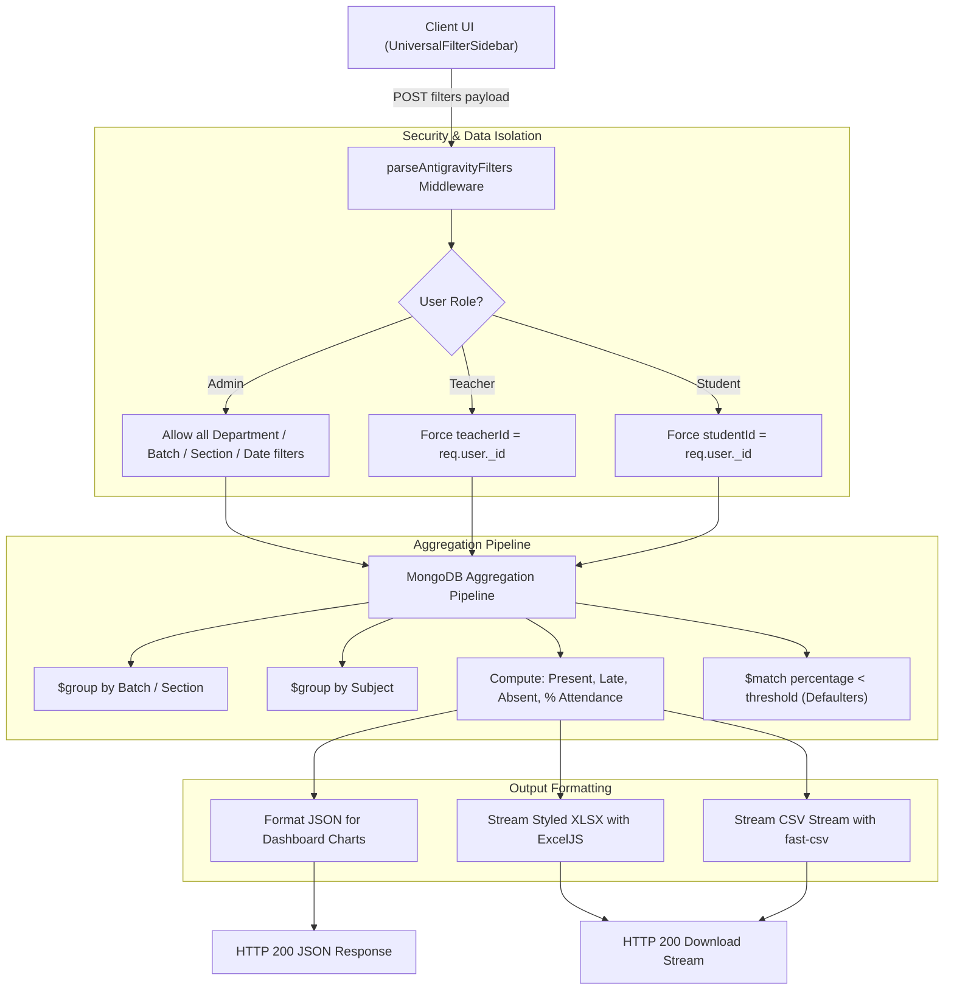

# Reports & Analytics Pipeline Architecture

This document describes the universal reporting pipeline that filters, aggregates, and exports attendance analytics across Student, Teacher, and Admin roles.

---

## Architecture Diagram



---

## Aggregation Formulas

1. **Present Equivalent Sessions**:
   ```javascript
   presentSessions = count(status IN ["Present", "Present (Manual)", "Late"])
   ```
2. **Attendance Percentage**:
   ```javascript
   percentage = totalConducted > 0 
     ? Math.round((presentSessions / totalConducted) * 100) 
     : 0
   ```
3. **Defaulter Flagging**:
   - If `percentage < systemSettings.defaulterThresholdPercent` (default: 75%), student is flagged with `status: "Critical Defaulter"` and queued for automated email notifications.
