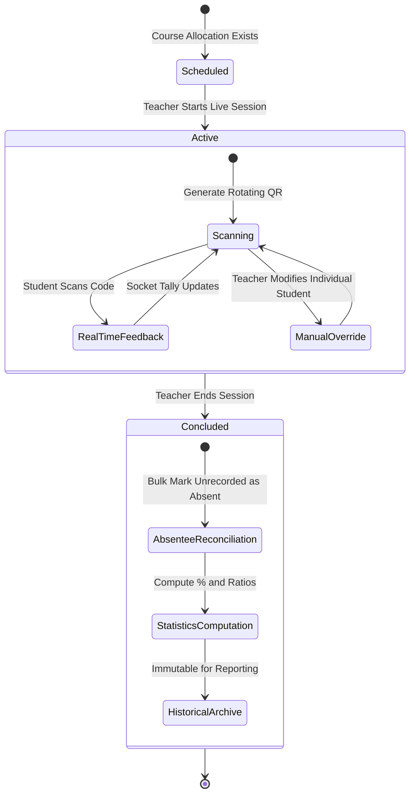

# Session Lifecycle Data Flow

This document describes the state machine and progression of an attendance session from initialization through active scanning, manual adjustments, and conclusion.

---

## State Transition Diagram

---

## Lifecycle Steps

### Step 1: Initialization (`POST /api/v2/sessions/start`)
- Validates teacher's ownership of the course allocation and section.
- Ensures no conflicting active session exists for this teacher.
- Records GPS coordinates, IP address, and dynamic security flags (radius, device lock, IP match).
- Connects to Socket.io namespace and joins the session room.

### Step 2: Live In-Session Activity
- Teacher displays rotating QR on classroom display or projector.
- Students submit scans via `POST /api/v2/attendance/mark`.
- WebSocket broadcasts `attendance:marked` to `session:<id>`, instantly updating:
  - Present counter
  - Percentage gauge
  - Live student feed list
  - Flagged suspicious scan warnings

### Step 3: Manual On-The-Fly Overrides (`PUT /api/v2/attendance/:id`)
- If a student's phone battery dies or camera is broken, teacher can search the student on the roster and mark them `Present (Manual)`.
- Teacher can adjust status to `Late` or `Leave`.

### Step 4: Closing & Reconciliation (`POST /api/v2/sessions/:id/end`)
- Session `active` flag is set to `false`.
- MongoDB runs an absentee reconciliation query:
  - Enrolled students of the allocated batch/section who do not have an attendance entry for this `sessionId` are inserted with `status = "Absent"`.
- Calculates total attendance rate and dispatches `session:ended` event.
- Session is permanently archived for institutional reporting.
